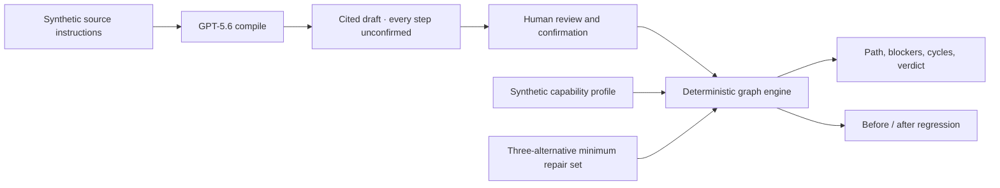
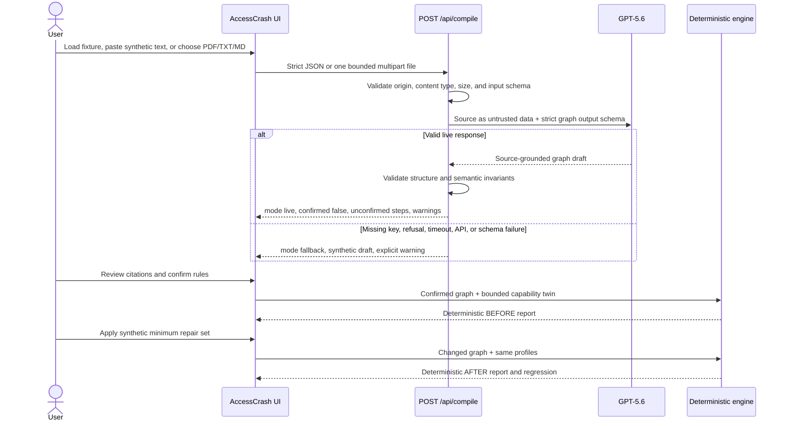

# AccessCrash Architecture

## System goal

AccessCrash separates **process interpretation** from **process proof**.

GPT-5.6 is useful for translating messy instructions into a structured draft,
but it is not a trustworthy reachability judge. The graph becomes eligible for
evaluation only after human confirmation. A pure deterministic engine then owns
the only authoritative states: `REACHABLE`, `BLOCKED`, or `UNKNOWN`.



This boundary is the product, not an implementation detail.

## Runtime flow



No database is in the runtime path. Source text, model drafts, confirmation
state, profiles, and reports remain ephemeral in the Build Week prototype.

## Components

### Product UI

The UI owns interaction state, not truth. Its responsibilities are:

- loading the fictional Pineglass Institute · Access Grant fixture or bounded user
  text;
- making live versus fallback compilation unmistakable;
- displaying source excerpts beside the rule derived from them;
- requiring explicit review and confirmation;
- selecting a fixed standard profile and capability-constrained twin;
- invoking the pure engine and rendering its returned proof;
- applying a clearly disclosed, three-alternative in-memory repair simulation;
- resetting all local state for another test.

The primary sequence is:

`Compile access path` → `Confirm N source-linked rules` →
`Run deterministic crash test` → `Test 3-change repair set` →
`Start another test`.

### Compilation boundary

[`app/api/compile/route.ts`](../app/api/compile/route.ts) accepts two bounded
request shapes. Pasted text uses strict JSON:

```ts
{ sourceText: string; sourceName?: string }
```

After normalization, JSON `sourceText` must contain at least 40 characters and
is limited to 96 KiB of UTF-8.

File input uses `multipart/form-data` with exactly one `file` and an optional
`sourceName`:

- PDF: at most 4 MiB, with an allowed PDF or generic MIME type, `.pdf`
  extension, and `%PDF-` signature. Bytes remain in memory and are passed to
  the Responses API as a `data:application/pdf;base64,...` `input_file` plus
  separate bounded `input_text` instructions. Extraction is provider-side at
  `detail: "low"`.
- TXT or Markdown: valid UTF-8 `.txt` or `.md`, at most 96 KiB, converted to
  bounded `input_text`.

The app does not crawl embedded URLs, execute embedded document content, or
persist uploaded bytes.

It returns the stable envelope:

```ts
{
  mode: "live" | "fallback";
  draft: AccessProcessDraft; // every step starts unconfirmed
  warnings: string[];
  confirmed: false;
}
```

The route is responsible for:

- validating request method, browser origin/fetch metadata when supplied,
  content type, size, and input shape;
- passing source text to the model as untrusted data;
- calling exact model `gpt-5.6-sol` with low reasoning, low text verbosity,
  structured output, `store: false`, a 10,000-token output cap, a 60-second
  timeout, and zero automatic retries;
- rejecting output that violates the graph schema or semantic invariants;
- failing closed to synthetic fallback in production unless the explicit
  server-side live-model flag is enabled;
- returning a plainly labeled synthetic fallback on controlled model failure;
- never returning a model-authored reachability or eligibility verdict.

Validation failures return the stable bounded envelope
`{ error: { code, message } }` without source text or provider details.

The fallback is a judgeability path, not a source compiler. It must not imply
that the supplied text produced the bundled synthetic graph. The production
enable flag is only a fail-safe switch; it does not replace identity, quota, or
rate controls.

### Schemas

[`lib/accesscrash-schema.ts`](../lib/accesscrash-schema.ts) is the contract
boundary for source input, process graphs, capability profiles, and
deterministic reports. All strings and collections are bounded. Unknown fields
are rejected where accepting them could blur authority.

The graph represents only what the engine needs to prove a route:

- stable nodes and directed transitions;
- journey timing and a declared outcome step;
- operational requirements and capability predicates;
- source grounding for extracted rules;
- explicit confirmation and unresolved-evidence state.

The model-facing schema deliberately omits a verdict field.

Citation validation is deliberately narrow. Code verifies shape, bounds,
declared source IDs, and duplicate references. For text sources, every
normalized candidate quote must occur in the supplied text. PDF quotes cannot
be byte-matched locally and produce an explicit review warning. No check
authenticates a document or proves that a quote semantically supports the
extracted rule; that is why the review UI exposes citations before confirmation.

Dependencies and capabilities use an explicit **OR-of-AND** contract. A step
may expose multiple alternative routes; every item inside the selected route's
`allOf` list is required. This supports statements such as “complete either the
online route or the advisor route” without asking the model to evaluate the
choice at runtime.

Unknown time is represented as `null`, never invented. A `null` journey
timestamp, step duration, or availability collection is unresolved evidence;
an empty availability collection is allowed only when the source explicitly
establishes unrestricted availability.

### Deterministic engine

[`lib/accesscrash-engine.ts`](../lib/accesscrash-engine.ts) is a pure function.
For the same confirmed graph and profile it must return the same report.

Its responsibilities are bounded to graph mechanics:

- validate that evaluation preconditions are satisfied;
- identify transitions available to the selected capability profile;
- search for at least one valid route through entry conditions to the declared
  outcome step;
- identify relevant cycles and disconnected regions;
- return graph-grounded blockers when no path exists;
- return `UNKNOWN` when an unconfirmed step, unknown capability, or unresolved
  timing or dependency prevents proof;
- compare BEFORE and AFTER results without model involvement.

For each step, the engine resolves prerequisite alternatives, capability
alternatives, human confirmation, duration, the journey deadline, step
availability, and profile availability. It chooses the earliest reachable
route deterministically. Missing capability state propagates `UNKNOWN`; a known
unavailable capability or impossible time window contributes a blocker. Missing
journey or step timing propagates the `unresolved-time` reason.

Directed cycles are detected with Tarjan's strongly connected components
algorithm. Blocker combinations are normalized into bounded minimal blocker
sets. Version comparison classifies each profile as `REGRESSION`,
`POTENTIAL_REGRESSION`, `RECOVERY`, `UNCHANGED`, or `CHANGED`.

The engine does not interpret raw policy prose, infer user characteristics, or
repair the process.

### Synthetic samples

[`lib/sample-accesscrash.ts`](../lib/sample-accesscrash.ts) contains three
fictional Pineglass Institute · Access Grant states:

- `pineglassBaselineProcess` — the process with the demonstrable access crash;
- `pineglassRepairedProcess` — the minimum demo repair set: email verification,
  mobile upload, and evening review alternatives that together open a route;
- `pineglassRegressedProcess` — a deliberate regression used to prove the engine
  catches a path closing again.

These are fixtures, not records of a real institution, program, or applicant.

### Deterministic reports

[`lib/accesscrash-report.ts`](../lib/accesscrash-report.ts) formats engine output
without adding model interpretation. A report should keep the following linked:

- graph and profile identity;
- confirmation state;
- verdict;
- reachable path when present;
- blockers, cycles, or unresolved evidence when present;
- source rule references;
- BEFORE / AFTER regression result.

## Authority matrix

| Decision or transformation | GPT-5.6 | Human | Deterministic code |
| --- | ---: | ---: | ---: |
| Extract candidate steps from prose | Drafts | Reviews | Validates shape |
| Attach source excerpts | Drafts | Reviews | Checks bounded contract |
| Resolve ambiguous policy meaning | No | Yes, outside model authority | No |
| Confirm graph | No | Yes | Enforces precondition |
| Decide eligibility | No | No, out of product scope | No |
| Decide reachability | No | No | Yes |
| Detect path / blocker / cycle | No | No | Yes |
| Propose a demo repair set | May describe only if separately bounded | Chooses | Recomputes impact only |

## Trust boundaries

1. **Source boundary** — all pasted or locally loaded text is untrusted and may
   include prompt injection, private data, malformed encodings, or unsupported
   claims.
2. **Model boundary** — GPT output is untrusted until strict structural and
   semantic validation, and remains unconfirmed afterward.
3. **Human boundary** — confirmation approves graph representation only; it is
   not a policy, legal, or fairness certification.
4. **Engine boundary** — deterministic output is authoritative only within the
   supplied confirmed graph and selected synthetic profile.
5. **Presentation boundary** — rendering must not upgrade a limited graph result
   into a real-world outcome claim.

## Failure behavior

| Failure | Required behavior |
| --- | --- |
| Invalid request | Reject with a bounded client error; do not call GPT |
| Missing key | Return visibly labeled synthetic fallback |
| Production live flag unset or false | Return visibly labeled synthetic fallback without calling GPT |
| Model refusal, timeout, or API error | Return visibly labeled synthetic fallback and warning |
| Incomplete model response or canonical fixture-ID drift | Discard it; return fallback, never a partial or unstable live demo |
| Schema-invalid model output | Discard it; return fallback, never partial live data |
| Unconfirmed graph | Do not issue an authoritative verdict |
| Unconfirmed or unresolved graph evidence | Return `UNKNOWN` with the exact unresolved reason |
| Schema-invalid or referentially inconsistent graph | Reject before evaluation |
| No valid route proven | Return `BLOCKED` with graph-grounded blockers |
| UI or model failure after a prior run | Do not silently reuse a stale verdict for changed inputs |

## Why not a chat interface

The critical interaction is not a conversation. It is a visible chain of
custody from source excerpt to confirmed rule to deterministic path result.
Chat can hide which statement is grounded, who approved it, and what logic
produced the conclusion. AccessCrash therefore uses a reviewable process map
and explicit state transitions instead.

## Deployment boundary

The repository is designed for the OpenAI Sites/vinext runtime. Deployment is a
separate, explicitly approved action. A successful local build does not prove
that a public URL, model key, access policy, or signed-out judge flow is live.
