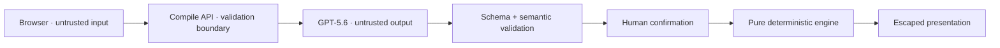

# AccessCrash Threat Model

## Scope

This threat model covers the Build Week prototype: the browser UI,
`POST /api/compile`, the GPT-5.6 call, strict process schemas, human
confirmation, the deterministic reachability engine, and in-memory reports.

The prototype accepts publicly available or organization-owned, non-personal
education-process documents. It is not approved for student/applicant records,
PII, confidential case data, operational eligibility decisions, or production
casework. Demo, fixture, screenshot, and test material is fully synthetic.

## Security objectives

1. A model cannot decide or silently influence an authoritative reachability
   verdict.
2. Untrusted source text cannot escape its data boundary or trigger tools,
   network access, code execution, or persistence.
3. A fallback cannot be mistaken for a live compilation of the supplied source.
4. A result cannot be presented as confirmed when its graph was not reviewed or
   when the graph changed after confirmation.
5. Secrets and personal data do not enter client bundles, fixtures, logs,
   screenshots, or public artifacts.
6. Resource bounds prevent one request or graph from causing unbounded model
   spend or graph work.
7. Product copy does not convert a narrow graph result into an eligibility,
   fairness, legal, or compliance claim.

## Assets

- server-side `OPENAI_API_KEY`;
- integrity of the model/human/deterministic authority boundary;
- integrity of the source-to-rule citations;
- integrity of confirmation state;
- integrity of the selected capability profile and deterministic report;
- confidentiality of any text a user pastes despite the synthetic-data warning;
- availability and bounded cost of the compile endpoint;
- trustworthiness of public demo and submission claims.

## Actors

- a legitimate evaluator using bundled synthetic data;
- a user who accidentally pastes personal or confidential information;
- a malicious anonymous caller attempting prompt injection, output manipulation,
  denial of service, or API-cost exhaustion;
- malicious or malformed source content;
- an unreliable model response, including refusal, hallucination, truncation,
  or schema drift;
- a well-intentioned reviewer who confirms an incorrect draft.

## Trust boundaries

No arrow grants broader authority to the component on its right. In
particular, validation makes a model draft well-formed; it does not make the
draft true.

## Threats and required controls

| Threat | Failure mode | Required mitigation | Residual risk |
| --- | --- | --- | --- |
| Prompt injection in source text | Source says to ignore the schema, reveal secrets, or emit a verdict | Treat source as quoted data; no tools; strict structured output; bounded fields; post-validate; model contract has no verdict | A well-formed but wrong extraction can remain; human review is still required |
| Hallucinated process rule | GPT invents a requirement or transition | Require at least one bounded source citation per step; show the excerpt beside the rule; keep every compiled step `unconfirmed` | A reviewer may overlook a subtle fabrication |
| Forged or misleading citation | Extracted quote is fabricated or does not support the rule | Validate citation shape, bounds, declared source IDs, and duplicates; make candidate quotes inspectable; reject malformed output | V1 does not attest quote provenance or semantic support; a reviewer can still confirm a misleading citation |
| Model-authored eligibility or verdict | GPT says a student qualifies or a path passes | Omit those fields from model schema; reject unknown authority fields; deterministic engine owns verdict enum | Model prose must also be kept out of authoritative UI regions |
| Confirmation bypass | UI or crafted input evaluates an unconfirmed graph | Engine checks the confirmation precondition and returns non-authoritative `UNKNOWN` or a contract error | Client-only confirmation is not identity assurance; this prototype has no approval workflow |
| Stale confirmation | Source, graph, or rule changes after review but old verdict remains visible | Any graph or source mutation invalidates confirmation and recomputes; clear stale report state | Visual state bugs remain possible and require interaction tests |
| Client graph tampering | Caller inserts impossible nodes, duplicate IDs, unknown predicates, or cycles intended to confuse output | Strict schemas, referential-integrity checks, enum constraints, graph-size caps, pure evaluation | The engine proves only the validated supplied graph, not source authenticity |
| Fallback presented as live | Model failure silently substitutes a sample graph | Return `mode: "fallback"`, warnings, and only `unconfirmed` steps; label the bundled graph synthetic; never claim it came from user text | Users may ignore labels; fallback UI must be visually prominent |
| Personal data pasted by mistake | Student, applicant, family, or confidential case data is sent to the model | Prominent public/non-personal-document-only warning; explicit prohibition on student records and PII; bounded input; no application persistence; `store: false`; synthetic fixtures and screenshots | `store: false` is not a substitute for a real privacy program; prevention depends partly on user behavior |
| Secret disclosure | API key reaches browser, logs, error bodies, fixture, or git | Server-only environment variable; never `NEXT_PUBLIC_`; sanitized errors; secret scans before handoff | Hosting configuration must be checked separately from source review |
| Stored-data exposure | Source, graph, or report remains in D1/R2/logs | No application persistence or analytics payloads containing content; no D1/R2 requirement; keep response data in transient UI state | Infrastructure request logs may retain metadata; provider behavior is outside this repository |
| XSS or UI injection | Source or model text renders executable markup | React escaped text only; no raw HTML, `dangerouslySetInnerHTML`, or model-controlled URLs; `nosniff` response header | Future rich-text rendering would reopen this threat; page CSP and embedding policy still require deployment-specific compatibility review |
| SSRF or malicious document behavior | A PDF contains links, actions, malformed objects, or content that attempts external retrieval | Accept only one bounded PDF/TXT/MD; verify extension, MIME, size, and PDF signature; keep bytes in memory; send PDF as provider-side `input_file`; disable app URL fetching, tools, shell, and embedded actions | Provider-side PDF parsing is an external trust boundary; malformed-file behavior and provider limits require integration tests |
| Oversized request or graph | Large text/model output consumes memory, tokens, or CPU | Content-length and parsed-size caps; bounded strings, nodes, edges, citations, and warnings; explicit timeout | Exact production proxy limits must still be verified |
| API-cost exhaustion | Anonymous or non-browser callers repeatedly trigger GPT-5.6 | Production fails closed to fallback unless the explicit server flag is true; cross-origin browser requests are rejected when metadata is supplied; one bounded model call maximum; zero retries; identity and persistent quota/rate controls required before enabling public live use | The flag and origin checks are not authentication or rate limiting; misconfiguration without verified controls reopens public spend risk |
| Algorithmic denial of service | Adversarial graph causes excessive traversal or cycle work | Small schema caps, memoized graph evaluation, bounded blocker-set expansion, and linear-time cycle detection | Limits must be exercised by tests at maximum accepted size |
| Protected-trait inference | Capability constraints become proxies for demographic classification | Use functional constraints only; do not request or infer protected traits; no real applicants; no population ranking | Functional barriers can still correlate with protected traits; field use requires governance and research |
| Policy overclaim | UI turns a graph result into fairness, accessibility, legal, or compliance certification | Narrow verdict language and persistent scope copy; no certification badges or applicant recommendation | Marketing drift is a continuing review risk |
| Unofficial or stale source | A user pastes incomplete or outdated instructions | Display source name and scope; require human confirmation; state that authority and freshness are not verified | AccessCrash cannot authenticate source provenance in V1 |
| Minimum-repair-set overclaim | The three-alternative demo repair is interpreted as a real, safe operational recommendation | Label it a synthetic in-memory repair-set test; name all three alternatives; preserve source and policy-review disclaimers | Real changes can have cost, legal, security, and operational consequences not modeled here |

## Data lifecycle

### Browser

- Source text and derived state exist in the current page session.
- `Start another test` clears the working analysis state.
- The prototype must not write process content to local storage, IndexedDB,
  cookies, analytics, or a service worker cache.

### Server

- The compile route validates and processes one bounded request in memory.
- PDF input is limited to 4 MiB and checked by MIME type, extension, and
  `%PDF-` signature before it is encoded as an in-memory
  `data:application/pdf;base64,...` `input_file` with `detail: "low"`. The app
  does not parse it locally; extraction occurs at the model provider.
- UTF-8 TXT/Markdown file input is limited to 96 KiB and becomes bounded
  `input_text`.
- Normalized pasted JSON text is limited to 96 KiB.
- It does not write source text, draft graphs, warnings, or reports to D1, R2,
  the filesystem, or an application log.
- Errors returned to the client are stable, bounded, and do not contain request
  content, stack traces, identity headers, or provider details.

### Model provider

- Requests set `store: false`.
- Only public or organization-owned non-personal process content is permitted;
  student/applicant records, PII, and confidential case data are prohibited.
- Demo, test, fixture, and screenshot inputs are fully synthetic.
- Live compilation sends the accepted text or in-memory PDF to OpenAI for
  processing; the UI must disclose this before a user chooses a document.
- The product must not imply that `store: false` alone provides a complete
  privacy, retention, or regulatory program.

## Confirmation integrity

Human confirmation is a safety boundary, not decorative UI. The implementation
must preserve these invariants:

1. a compiled draft begins unconfirmed;
2. confirmation is explicit and covers every reviewable rule;
3. any rule, graph, source, or profile mutation invalidates stale evaluation;
4. deterministic reports identify the exact graph/profile version they used;
5. fallback state remains visible after confirmation;
6. `UNKNOWN` is preferred whenever evidence cannot support a proof.

## Deployment gates

Before a public deployment may use a live API key, verify and record:

- the key exists only in the server environment;
- anonymous request and cost controls are active at the hosting boundary;
- server-side identity and persistent per-user quota/rate controls are active;
- origin and content-type rejection works in the deployed runtime;
- global `Referrer-Policy`, `X-Content-Type-Options`, and restrictive
  `Permissions-Policy` headers survive the hosting path;
- request, graph, output-token, and timeout limits behave as documented;
- provider errors and schema-invalid outputs cannot leak details;
- the public UI labels live and fallback mode correctly;
- D1 and R2 are not used for process content;
- no analytics or logging sink captures source or model output;
- signed-out access policy matches the intended judge flow;
- a key-rotation and deployment rollback path is known;
- only after every control above passes,
  `ACCESSCRASH_ENABLE_PUBLIC_LIVE_MODEL=true` is set server-side.

If identity or cost controls are not verified, keep
`ACCESSCRASH_ENABLE_PUBLIC_LIVE_MODEL=false` and deploy the transparent
synthetic fallback path. Do not hide that limitation.

## Out-of-scope risks requiring a new review

The following changes invalidate this threat model and require redesign before
implementation:

- real student or applicant data;
- saved projects, accounts, workspaces, sharing, or collaboration;
- additional file types, local/server-side document parsing, or embedded-content
  execution beyond the current bounded provider-side PDF extraction;
- URL crawling or retrieval;
- external tools, agents, shell commands, or automatic service changes;
- demographic inference, population scoring, or individual recommendations;
- eligibility, financial-aid, legal, fairness, or compliance decisions;
- automated contact with a student or institution;
- production use by a real education provider.

## Known residual risks

- Source grounding reduces but does not eliminate model hallucination.
- A human can confirm an incorrect graph.
- A graph can omit real barriers that are absent from the supplied text.
- Capability profiles cannot reproduce the full context of a person's lived
  experience.
- A deterministic result can be precisely wrong when its confirmed graph is
  wrong.
- Anonymous live-model abuse remains a deployment risk if the production flag
  is enabled before identity and persistent quota/rate controls are verified;
  the default fallback-only state fails closed.

These limitations are product facts and must remain visible in the README,
demo, and submission copy.
